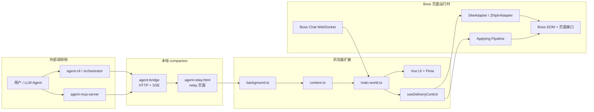
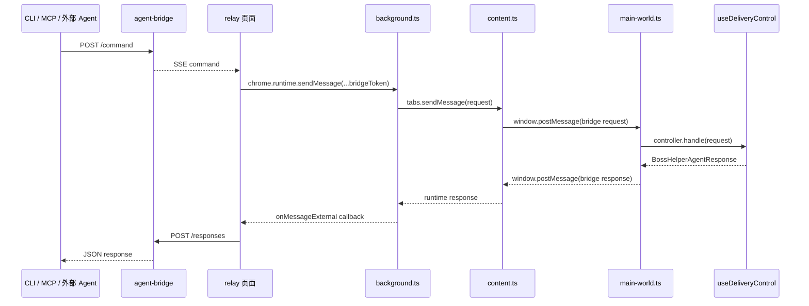
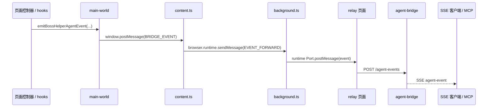

# Boss Helper Architecture

Boss Helper 当前是一个以浏览器扩展为执行核心、以本地 companion 服务为外部入口的多层系统。

核心目标有 3 个：

- 把 Boss 页面内的 DOM 自动化、投递管线和 UI 状态管理拆开
- 让同一套页面控制器既能被插件 UI 驱动，也能被 CLI / MCP / 外部 Agent 驱动
- 把站点耦合点收敛到 `SiteAdapter` 和选择器注册表，降低后续多站点扩展成本

## 系统总览



## 运行层级

| 层级 | 关键文件 | 职责 |
| --- | --- | --- |
| 本地 companion | `scripts/agent-bridge.mjs` | 暴露 localhost HTTP / HTTPS / SSE 接口，维护命令队列、relay 连接和事件缓存 |
| MCP 封装 | `scripts/agent-mcp-server.mjs` | 把 bridge HTTP 能力包装为 stdio MCP tools |
| Relay 页面 | `scripts/agent-relay.html` | 把 bridge SSE 命令转发给扩展，把扩展事件回传到 bridge |
| 扩展后台 | `src/entrypoints/background.ts` | 校验外部 relay 来源和 token，找到目标 Boss 标签页并转发请求 |
| Content Script | `src/entrypoints/content.ts` | 注入 `main-world.js`，连接后台消息桥，做选择器健康检查 |
| Main World | `src/entrypoints/main-world.ts` | 选择站点 adapter、挂载 Vue UI、运行页面模块和控制器 |
| 页面控制器 | `src/pages/zhipin/hooks/useDeliveryControl.ts` | 统一接收 `start/pause/resume/...` 等 agent 命令 |
| 投递执行层 | `src/pages/zhipin/hooks/useAgentBatchRunner.ts`、`agentBatchLoop.ts`、`useDeliver.ts` | 批处理状态机、翻页循环、单岗位投递执行 |
| 站点抽象层 | `src/site-adapters/type.ts`、`src/site-adapters/zhipin/adapter.ts` | 收敛站点差异：职位解析、详情解析、翻页、导航、选择器 |
| 管线层 | `src/composables/useApplying/services/pipelineFactory.ts` | 规则过滤、卡片加载、高德距离、AI 审核、招呼语等步骤编排 |

## Agent 命令流

外部请求不会直接打到页面，而是经过 bridge -> relay -> 扩展 -> 页面控制器四段链路。



## 事件回流

批量投递状态变化、AI 审核等待、聊天发送结果等事件会走反向链路回到 bridge 的 SSE。



## 投递管线

Boss Helper 的投递不是单个函数直接完成，而是按步骤编译出的 before / after 队列执行。

```mermaid
flowchart TD
  A[startBatch / resumeBatch]
  A --> B[applyAgentBatchStartPayload]
  B --> C[executeAgentBatchLoop]
  C --> D[jobListHandle]
  D --> E[createHandle -> createApplyingPipeline]
  E --> F[before steps]
  F --> G[getActiveSiteAdapter().applyToJob]
  G --> H[after steps]
  H --> I[log + statistics + cache]
  I --> J{继续同页 / 翻页 / 停止}
  J -->|下一岗位| D
  J -->|下一页| C
```

当前 `createApplyingPipeline()` 的主要步骤顺序：

1. `communicated`
2. `sameCompanyFilter`
3. `sameHrFilter`
4. `jobTitle`
5. `company`
6. `salaryRange`
7. `companySizeRange`
8. `goldHunterFilter`
9. `loadCard`
10. `activityFilter`
11. `hrPosition`
12. `jobAddress`
13. `jobFriendStatus`
14. `jobContent`
15. `resolveAmap`
16. `amap`
17. `aiFiltering`
18. `applyToJob`
19. `greeting`（after 阶段）

几个关键点：

- `loadCard` 之后才进入依赖职位详情的过滤步骤
- `aiFiltering` 同时支持内部模型和外部审核模式
- `greeting` 属于 after 步骤，只在投递动作完成后执行
- `pipelineCompiler.ts` 会给每个步骤附上名字，并在异常时记录结构化 `pipelineError`

## 消息通信层

除了 bridge 链路，扩展内部还有一层类型化消息抽象。

| 通道 | 方向 | 关键文件 | 用途 |
| --- | --- | --- | --- |
| `browser.runtime.onMessageExternal` | relay -> background | `src/entrypoints/background.ts` | 接收外部页面发来的 agent 命令 |
| `browser.tabs.sendMessage` | background -> content | `src/entrypoints/background.ts` | 把命令转到目标 Boss 标签页 |
| `window.postMessage` | content <-> main-world | `src/message/contentScript.ts`、`useDeliveryControl.ts` | 跨隔离世界传递命令与响应 |
| `browser.runtime.connect` | background -> relay | `background.ts`、`agent-relay.html` | 实时 agent 事件推送 |
| `comctx defineProxy` | background <-> content <-> inject | `src/message/index.ts`、`background.ts`、`contentScript.ts` | 存储、cookies、通知等扩展能力代理 |

## 状态与存储

| 类型 | 关键模块 | 说明 |
| --- | --- | --- |
| 运行时状态 | `useCommon` | 保存 `deliverLock`、`deliverStop`、`deliverState` 等短生命周期状态 |
| Agent 状态 | `src/stores/agent.ts` | 保存目标岗位集合、批处理 Promise、停止请求标记 |
| 岗位数据 | `src/stores/jobs.ts` | 当前页职位列表、职位状态、详情缓存入口 |
| 配置 | `src/stores/conf/` | 表单配置、运行时 patch、字段级校验 |
| 日志 | `src/stores/log.tsx` | 结构化投递日志和管线错误上下文 |
| 统计 | `src/composables/useStatistics.ts` | 今日统计、历史统计、token / 成本累计 |
| 管线缓存 | `src/composables/usePipelineCache.ts` | 按用户隔离的 TTL + LRU 结果缓存 |

## 站点适配策略

`SiteAdapter` 是当前架构里最重要的扩展点之一。接口收敛了这些能力：

- `parseJobList()`
- `parseJobDetail()`
- `applyToJob()`
- `navigatePage()`
- `buildNavigateUrl()`
- `getSelectors()`

现在仓库只有 `ZhipinAdapter` 一个实现，但 `background`、`content`、`main-world`、`usePager` 和 `useDeliver` 已经改成依赖 adapter，而不是直接耦合具体站点。

## 聊天与 protobuf

聊天能力和投递能力是两条并行链路：

- `src/assets/chat.proto` 是 Boss chat 协议的完整 schema 来源
- `src/composables/useWebSocket/type.ts` 保留了当前插件运行所需的最小 runtime schema
- `src/pages/zhipin/services/chatStreamHooks.ts` 会 hook WebSocket / Chat SDK
- `src/pages/zhipin/services/chatStreamMessages.ts` 负责把 protobuf 帧解码为插件内部聊天消息

bridge 本身不直接传 protobuf；protobuf 只用于页面内 Boss 聊天 WebSocket 的编解码。

## 开发时优先看这些文件

1. `src/entrypoints/background.ts`
2. `src/entrypoints/content.ts`
3. `src/entrypoints/main-world.ts`
4. `src/pages/zhipin/hooks/useDeliveryControl.ts`
5. `src/pages/zhipin/hooks/useAgentBatchRunner.ts`
6. `src/pages/zhipin/hooks/agentBatchLoop.ts`
7. `src/composables/useApplying/services/pipelineFactory.ts`
8. `src/composables/useApplying/services/pipelineCompiler.ts`
9. `src/site-adapters/zhipin/adapter.ts`
10. `scripts/agent-bridge.mjs`

## 演进方向

按当前结构，后续继续演进时建议保持这几个边界不变：

- 新站点优先新增 adapter，不要把站点分支散回通用 hook
- 新 agent 命令优先先改 `src/message/agent.ts`，再同步 bridge / relay / README / MCP 文档
- 新管线步骤优先挂到 `pipelineFactory.ts`，并保持 before / after 语义清晰
- 新的本地自动化入口优先复用 bridge，而不是再开一套独立协议
